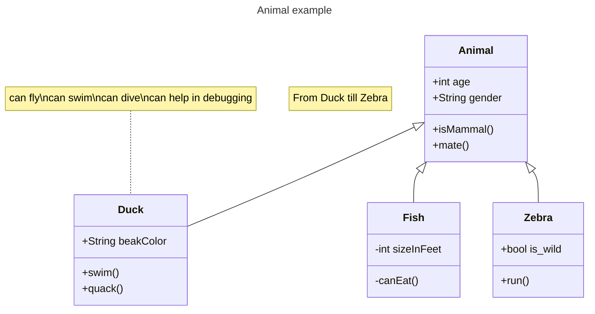

## Disseny d'Aplicacions Web - by Alexis López Riera

Document fet amb: Editor.md

<p align="center" width="100%">
    
</p>

  

[Curs de Moodle del mòdul 0487: Entorns de Desenvolupament](https://educaciodigital.cat/inslacetania/moodle/course/view.php?id=17871)

### Un exemple senzill <a name="punt1"></a>
```Python
def recorrer_dic(d):
  """
  Recorre un diccionari i mostra les seves claus i valors
  """
  for clau in d:
    print(clau, d[clau])
```

### Un altre exemple, amb doctest <a name="punt2"></a>
```Python
def recorrer_l(l):
    """
    Funció que recorre una llista de nombres i retorna la
    suma total dels números parells. Ignora els imparells.
    >>> recorrer_l([3, 4, 7, 2, 8, 9, 5, 1, 12])
    26
    """
    suma = 0
    for el in l:
        if el % 2 == 0:
            suma += el  
    return suma
```

### El mateix exemple anterior però amb List Comprehension <a name="punt3"></a>
```Python
def recorrer_l_comp(l):
    """
    Funció que recorre una llista de nombres i retorna la
    suma total dels números parells. Ignora els imparells.
    >>> recorrer_l_comp([3, 4, 7, 2, 8, 9, 5, 1, 12])
    26
    """ 
    return sum([el for el in l if el % 2 == 0])
```

### Diagrama de classes: <a name="punt4"></a>


