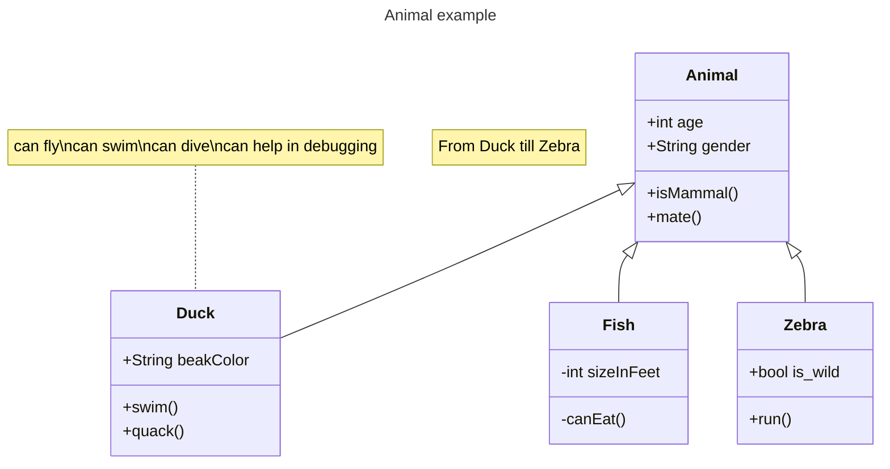

## Disseny d'Aplicacions Web - by Alexis López Riera

Document fet amb: Editor.md


    

[Curs de Moodle del mòdul 0487: Entorns de Desenvolupament](https://educaciodigital.cat/inslacetania/moodle/course/view.php?id=17871)

**Table of Contents**

Diagrama de classes:



### Funcions de mostra <a name="punt1"></a>
```Python
def recorrer_dic(d):
  for clau in d:
    print(clau, d[clau]
```

### Testing a Python <a name="punt2"></a>
```Python
def recorrer_dic(l):
  """
  Funció que recorre una llista i mostra els seus valors
  >>> recorrer_dic(["groc", "vermell", "blau"])
  [ 'groc', 'vermell', 'blau' ] 
  """
  for element in l:
    print(element)
```
